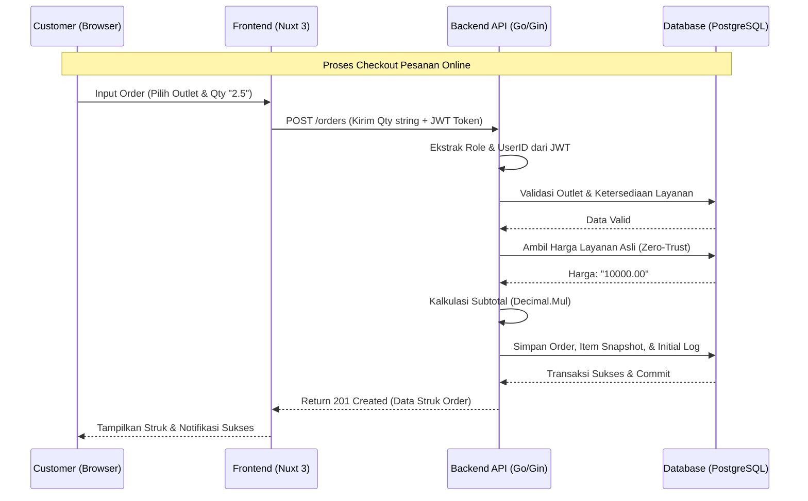
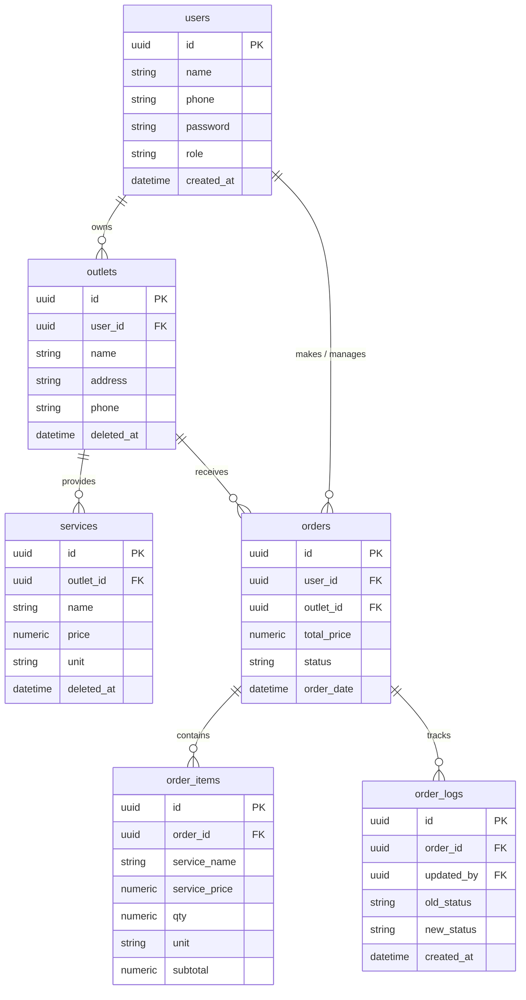

# PRD — Project Requirements Document: LaundryIn (Online Laundry Platform)

## 1. Overview
Aplikasi ini bertujuan untuk mentransformasi pengalaman pemesanan laundry menjadi sepenuhnya digital dan online. Masalah utama yang ingin diselesaikan adalah ketidakpraktisan pelanggan yang harus datang ke toko hanya untuk mengecek harga atau memesan, hilangnya presisi harga akibat floating-point anomaly di sistem tradisional, dan sulitnya pelanggan melacak status pengerjaan cucian mereka secara real-time.

Tujuan utama aplikasi adalah menyediakan platform berbasis web yang responsif bagi Pelanggan (Customer) untuk mengeksplorasi outlet laundry, memesan layanan secara online, dan melacak cucian. Di sisi lain, platform ini juga menyediakan Dashboard bagi Pemilik Bisnis (Owner) untuk mengelola multi-cabang, menyusun katalog layanan, memproses pesanan dengan akurasi finansial mutlak (berbasis desimal), serta memantau analitik pendapatan secara instan.

## 2. Requirements
Berikut adalah persyaratan tingkat tinggi untuk pengembangan sistem LaundryIn:
- **Aksesibilitas:** Aplikasi harus dapat diakses melalui Web Browser. Tampilan Mobile-First diutamakan untuk Pelanggan, dan tampilan Desktop/Tablet diutamakan untuk Dashboard Owner.
- **Pengguna & Multi-Role:** Sistem dirancang untuk multi-pengguna dengan pemisahan akses yang ketat antara Role Customer dan Role Owner. Setiap Owner menerapkan Tenant Isolation (hanya bisa mengelola outlet miliknya sendiri).
- **Integritas Finansial (Zero-Trust Pricing):** Input harga dan kuantitas saat checkout dari frontend wajib dikirim sebagai String. Backend memprosesnya menggunakan presisi Decimal untuk mencegah kerugian sepeser pun.
- **Data Snapshot:** Rincian pesanan (nama layanan, harga) harus disimpan sebagai snapshot permanen di database, sehingga riwayat transaksi tidak akan rusak meskipun master layanan dihapus di masa depan oleh Owner.
- **Audit Trail:** Sistem mewajibkan pencatatan jejak (Log) setiap kali ada perubahan status pesanan untuk transparansi antara Owner dan Customer.

## 3. Core Features
Fitur-fitur kunci yang harus ada dalam rilis versi 1.0 (MVP):
- **Authentication & Authorization:** Registrasi dan Login pengguna (Customer & Owner) menggunakan otentikasi JWT Token yang aman.
- **Eksplorasi & Manajemen Outlet:**
  - *Bagi Customer:* Dapat melihat daftar outlet LaundryIn yang tersedia.
  - *Bagi Owner:* Tambah, Edit, Hapus (Soft-Delete), dan kelola daftar outlet milik mereka sendiri.
- **Katalog Layanan (Master Data):**
  Manajemen jasa laundry per outlet (contoh: Cuci Kiloan, Cuci Karpet) beserta harga pasti dan satuan ukur (KG, PCS, METER). Customer dapat melihat katalog ini sebelum memesan.
- **Smart Checkout System (Order Engine):**
  Pembuatan pesanan baru oleh Customer secara mandiri (atau Kasir) dengan memilih layanan dan kuantitas. Subtotal dan Total harga dihitung secara tertutup dan tervalidasi oleh Backend.
- **Live Tracking & Finite State Machine:**
  Pelacakan status pesanan secara real-time dengan jalur yang dikunci: `Pending` ➔ `Process` ➔ `Completed` ➔ `Picked Up` (atau `Cancelled`).
- **Reporting & Analytics Dashboard:**
  Dasbor khusus Owner untuk melihat ringkasan total Omzet, metrik status pesanan, dan Top 5 Layanan Terlaris berdasarkan filter rentang tanggal dan Outlet.

## 4. User Flow
Alur kerja sederhana penggunaan aplikasi oleh Customer dan Owner:
1. **Setup Bisnis (Owner):** Owner login, membuat profil "Outlet Baru", lalu mendaftarkan "Katalog Layanan" (contoh: Cuci Kering 10.000/KG) di outlet tersebut.
2. **Pemesanan Online (Customer):** Customer login, memilih outlet terdekat, memasukkan item cucian ke dalam keranjang (misal: Cuci Kering, Qty: 2.5 KG), lalu menekan tombol Checkout.
3. **Validasi Sistem:** Sistem (Backend) secara otomatis mengambil harga asli dari database, menghitung subtotal secara presisi, lalu menerbitkan struk digital dengan status awal Pending.
4. **Pengerjaan & Tracking (Owner & Customer):** Owner menerima pesanan dan mulai mencuci. Owner mengklik tombol Update Status (menjadi Process, lalu Completed). Customer dapat memantau perubahan status ini langsung dari HP mereka.
5. **Pengambilan & Analitik:** Setelah status Completed, Customer mengambil/menerima cucian dan status berubah menjadi Picked Up. Di akhir hari, Owner membuka halaman "Dashboard" untuk melihat total omzet dan statistik harian.

## 5. Architecture
Berikut adalah gambaran arsitektur sistem dan aliran data secara teknis saat pembuatan pesanan online:

## 6. Database Schema
Berikut adalah Entity Relationship Diagram (ERD) yang menggambarkan struktur database LaundryIn:

**Tabel Deskripsi**
- **users**: Menyimpan kredensial autentikasi dan otorisasi (Role `owner` atau `customer`).
- **outlets**: Data cabang bisnis laundry yang dimiliki oleh Owner tertentu.
- **services**: Katalog layanan per outlet dengan presisi harga desimal (`numeric`).
- **orders**: Master transaksi pesanan, mencatat total harga dan status FSM saat ini. Terhubung ke User pemesan.
- **order_items**: Rincian barang pesanan. Menyimpan snapshot nama dan harga layanan saat transaksi terjadi.
- **order_logs**: Jejak audit (Audit Trail) yang mencatat setiap perubahan status pesanan secara immutable.

## 7. Design & Technical Constraints
Bagian ini mengatur batasan teknis dan panduan desain yang harus dipatuhi untuk menjaga stabilitas sistem.

- **High-Level Technology:** Sistem harus dibangun menggunakan teknologi modern dengan konsep Separation of Concerns (Monorepo-style) yang memisahkan folder Frontend dan Backend.
  - **Frontend:** Wajib menggunakan framework reaktif Nuxt 3 (Vue Composition API) dengan TypeScript untuk integritas data-binding, serta dikombinasikan dengan Tailwind CSS untuk kecepatan styling.
  - **Backend:** Wajib menggunakan bahasa terkompilasi Go (Golang) dengan sistem ORM GORM dan database relasional PostgreSQL untuk menjamin kapabilitas ACID dan kecepatan processing kalkulasi desimal secara aman.

- **Typography Rules:** Sistem antarmuka (UI) wajib menggunakan konfigurasi font variable yang modern dan "smooth" sebagai berikut untuk menjaga konsistensi visual:
  - **Sans:** Inter, sans-serif
  - **Serif:** serif
  - **Mono:** Roboto Mono, monospace
